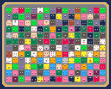
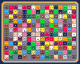

## Canned Monsters - Procedurally generated monsters in a sardines can

License: CC-BY

In-browser: on [itch.io](https://tonywang.itch.io/can) or [GitHub](https://paladin-t.github.io/can/html)

[Download](https://tonywang.itch.io/can): for Windows, MacOS, Linux

Yummy, yummy... Tap to eat.

This program is developed in the fantasy computer [BASIC8](https://store.steampowered.com/app/767240/). Check out the [homepage](https://paladin-t.github.io/b8/) for more.
